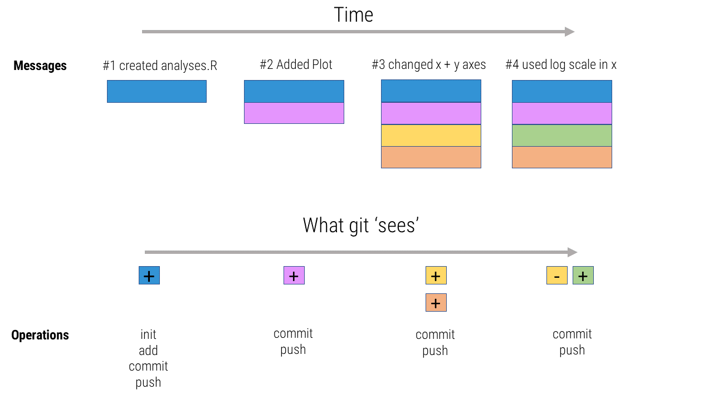
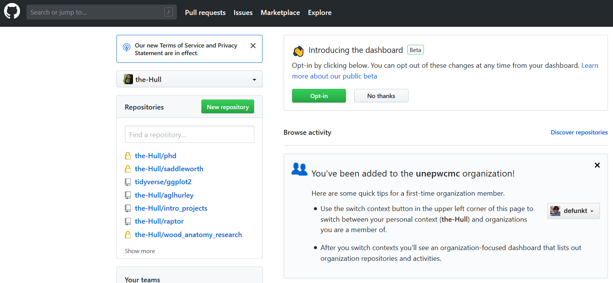
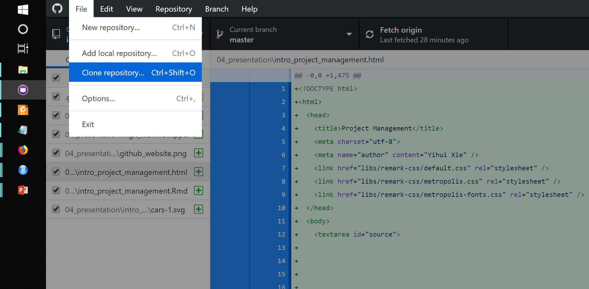

```{r setup, include=FALSE}
options(htmltools.dir.version = FALSE)


```

```{r funcs, echo=FALSE}


#Color Format
colt  <-  function(x,color){

    paste("<font color='",color,"'>",x,"</font>",sep="")

}


```


class: title-slide, left, middle

<h1> Intro to project management <br> with git, `r fontawesome::fa("github")` GitHub and RStudio </h1>

<br>


<h3> Alex Hurley <br> <em>University of Birmingham</em> </h3>
<br>
<br>
.small[`r fontawesome::fa("home")` [aglhurley.rbind.io](https://aglhurley.rbind.io)  
`r fontawesome::fa("twitter")` [aglhurley](https://twitter.com/aglhurley)]  


---
class: inverse, center


Science is messy.
<br>


Data isn't pretty. 
<br>


Analyses can be tough.
<br>
<br>
<br>
<br>
<br>


# _Debugging, data management, publishing/sharing code, archiving... ?_

---

# Overview

---

# Overview

1. Git

2. GitHub (Website & Desktop)

3. RStudio

4. Simple Workflow


---

class: inverse, center, middle

# Introducing Git


---
layout: true

# Git

## What does version control do?

---

- Git is a command-line program (_with GUI options_)
- Tracks changes:
  + what
  + when
  + who
  + why (!)

---
layout: true

# Git


---
## Why use version control?

.center[]


---

## Why use version control?


.center[]


---

## Workflow 




---

## Some hints

- _.gitignore_: contains folders and files you do not want to track  (e.g. _*.csv_, _credit_card_info.txt_)
- `git revert <commit #>` takes you back to better times
- `git clone` allows you to mirror a repository onto your local machine (e.g hosted on GitHub, GitLab, BitBucket)

--

### For collaboration

- forks, branches
- pull requests
- merge

--

## Some tips

- *Git and GitHub have great documentation,*
- [_Happy Git and GitHub for the useR_](http://happygitwithr.com) (J. Bryan, J. Hester) is an excellent resource 

---
layout: false
class: inverse, center, middle

# Introducing GitHub
<br>

# `r fontawesome::fa("github")`


---

layout: true

# GitHub

---

## What does GitHub provide

--

- free hosting (private repos for students)
- convenient web GUI 
- pre-defined settings (licenses, _.gitignore_)
--

- issue tracker
- project management
- exposure (_Readme.md_)

---

## First Steps

- Register
- Download [GitHub Desktop](https://desktop.github.com/)
- Create new repository

--


.center[]

---

## First Steps

- Register
- Download [GitHub Desktop](https://desktop.github.com/)
- Create new repository

--

- Open *GitHub Desktop*, follow instructions
- Clone repository to your local machine

--

.center[]

This won't make it into the final presentation


class: center, middle

# xaringan

### /ʃæ.'riŋ.ɡæn/

---
class: inverse, center, middle

# Get Started

---


# Hello Ninja

As a presentation ninja, you certainly should not be satisfied by the "Hello World" example. You need to understand more about two things:

1. The [remark.js](https://remarkjs.com) library;

1. The **xaringan** package;

Basically **xaringan** injected the chakra of R Markdown (minus Pandoc) into **remark.js**. The slides are rendered by remark.js in the web browser, and the Markdown source needed by remark.js is generated from R Markdown (**knitr**).

---

# remark.js

You can see an introduction of remark.js from [its homepage](https://remarkjs.com). You should read the [remark.js Wiki](https://github.com/gnab/remark/wiki) at least once to know how to

- create a new slide (Markdown syntax<sup>*</sup> and slide properties);

- format a slide (e.g. text alignment);

- configure the slideshow;

- and use the presentation (keyboard shortcuts).

It is important to be familiar with remark.js before you can understand the options in **xaringan**.

.footnote[[*] It is different with Pandoc's Markdown! It is limited but should be enough for presentation purposes. Come on... You do not need a slide for the Table of Contents! Well, the Markdown support in remark.js [may be improved](https://github.com/gnab/remark/issues/142) in the future.]

---
background-image: url(`r xaringan:::karl`)
background-size: cover
class: center, bottom, inverse

# I was so happy to have discovered remark.js!

---
class: inverse, middle, center

# Using xaringan

---

# xaringan

Provides an R Markdown output format `xaringan::moon_reader` as a wrapper for remark.js, and you can use it in the YAML metadata, e.g.

```yaml
---
title: "A Cool Presentation"
output:
  xaringan::moon_reader:
    yolo: true
    nature:
      autoplay: 30000
---
```

See the help page `?xaringan::moon_reader` for all possible options that you can use.

---

# remark.js vs xaringan

Some differences between using remark.js (left) and using **xaringan** (right):

.pull-left[
1. Start with a boilerplate HTML file;

1. Plain Markdown;

1. Write JavaScript to autoplay slides;

1. Manually configure MathJax;

1. Highlight code with `*`;

1. Edit Markdown source and refresh browser to see updated slides;
]

.pull-right[
1. Start with an R Markdown document;

1. R Markdown (can embed R/other code chunks);

1. Provide an option `autoplay`;

1. MathJax just works;<sup>*</sup>

1. Highlight code with `{{}}`;

1. The RStudio addin "Infinite Moon Reader" automatically refreshes slides on changes;
]

.footnote[[*] Not really. See next page.]

---

# Math Expressions

You can write LaTeX math expressions inside a pair of dollar signs, e.g. &#36;\alpha+\beta$ renders $\alpha+\beta$. You can use the display style with double dollar signs:

```
$$\bar{X}=\frac{1}{n}\sum_{i=1}^nX_i$$
```

$$\bar{X}=\frac{1}{n}\sum_{i=1}^nX_i$$

Limitations:

1. The source code of a LaTeX math expression must be in one line, unless it is inside a pair of double dollar signs, in which case the starting `$$` must appear in the very beginning of a line, followed immediately by a non-space character, and the ending `$$` must be at the end of a line, led by a non-space character;

1. There should not be spaces after the opening `$` or before the closing `$`.

1. Math does not work on the title slide (see [#61](https://github.com/yihui/xaringan/issues/61) for a workaround).

---

# R Code

```{r comment='#'}
# a boring regression
fit = lm(dist ~ 1 + speed, data = cars)
coef(summary(fit))
dojutsu = c('地爆天星', '天照', '加具土命', '神威', '須佐能乎', '無限月読')
grep('天', dojutsu, value = TRUE)
```

---

# R Plots

```{r cars, fig.height=4, dev='svg'}
par(mar = c(4, 4, 1, .1))
plot(cars, pch = 19, col = 'darkgray', las = 1)
abline(fit, lwd = 2)
```

---

# Tables

If you want to generate a table, make sure it is in the HTML format (instead of Markdown or other formats), e.g.,

```{r}
knitr::kable(head(iris), format = 'html')
```

