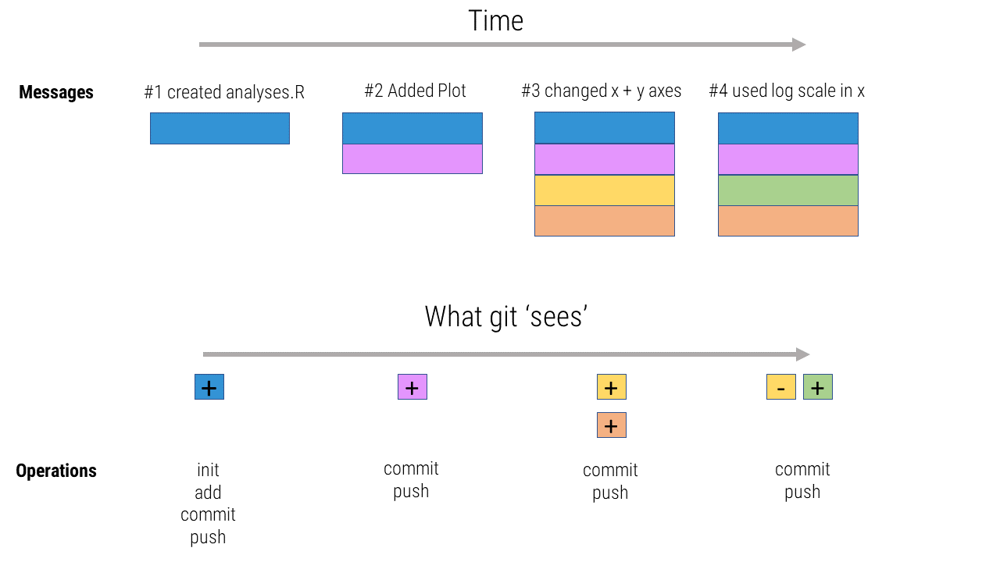
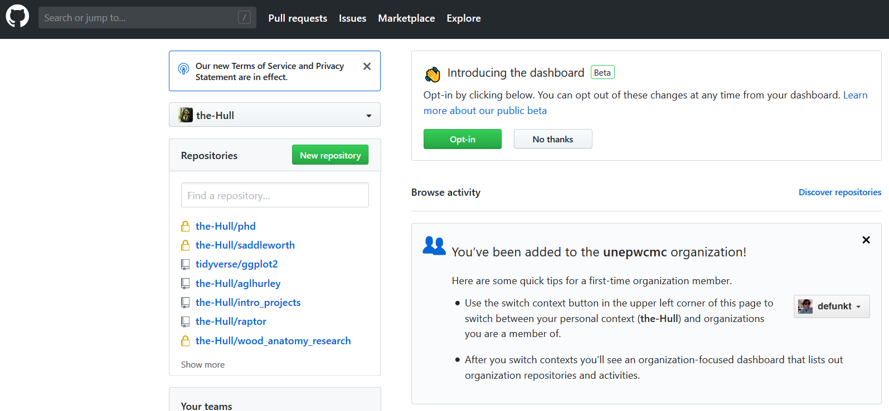
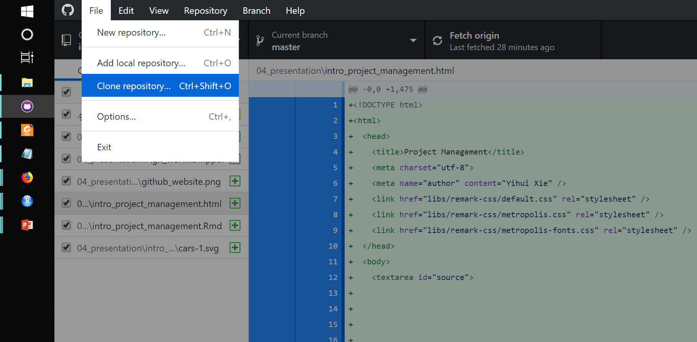
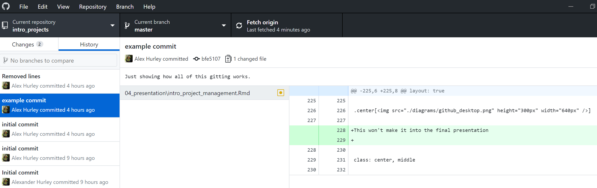
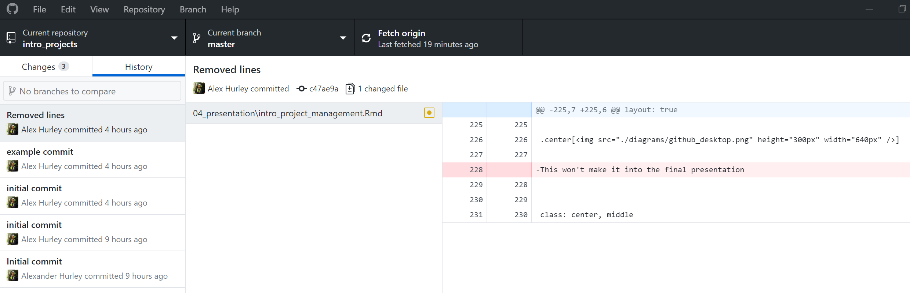
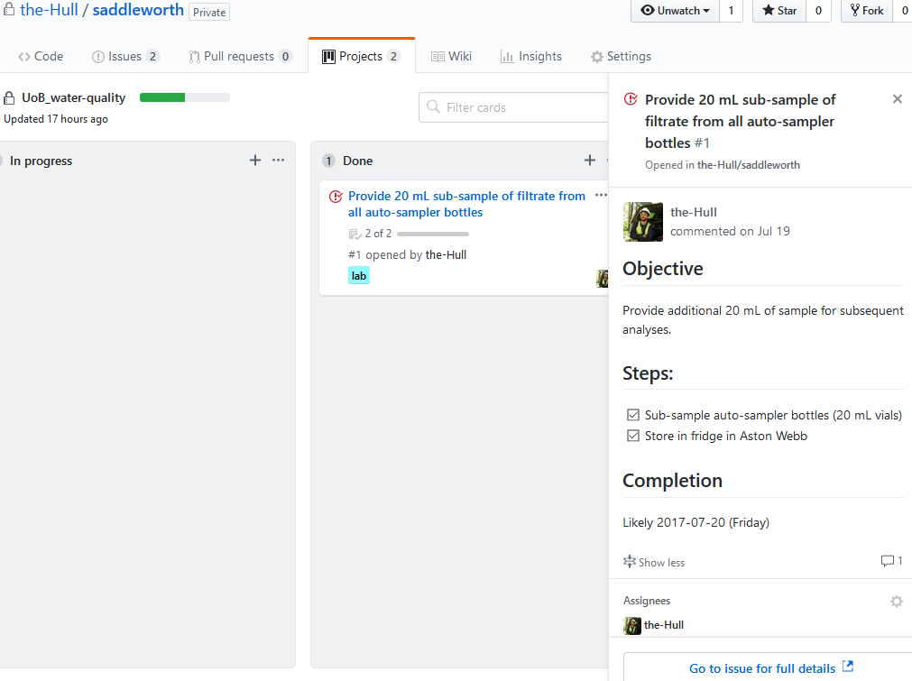
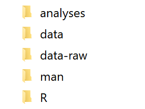
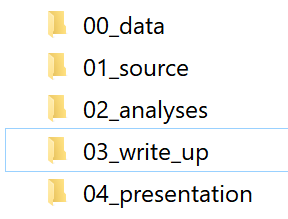

```{r setup, include=FALSE}
options(htmltools.dir.version = FALSE)


```


class: title-slide, left, middle

<h1> Intro to project management <br> with git, `r fontawesome::fa("github")` GitHub and RStudio </h1>

<br>


<h3> Alex Hurley <br> <em>University of Birmingham</em> </h3>
<br>
<br>
.small[`r fontawesome::fa("home")` [aglhurley.rbind.io](https://aglhurley.rbind.io)  
`r fontawesome::fa("twitter")` [aglhurley](https://twitter.com/aglhurley)]  


---
class: inverse, center


Science is messy.
<br>


Data isn't pretty. 
<br>


Analyses can be tough.
<br>
<br>
<br>
<br>
<br>


# _Debugging, data management, publishing/sharing code, archiving... ?_

---

# Overview

--


1. Git

2. GitHub (Website & Desktop)

3. Simple workflow with RStudio


---

class: inverse, center, middle

# Introducing Git


---
layout: true

# Git

## What does version control do?

---

- Git is a command-line program (_with GUI options_)
- Tracks changes:
  + what
  + when
  + who
  + why (!)

---
layout: true

# Git


---
## Why use version control?

.center[]


---

## Why use version control?


.center[]


---

## Workflow 




---

## Some hints

- _.gitignore_: contains folders and files you do not want to track  (e.g. _*.csv_, _credit_card_info.txt_)
- `git revert <commit #>` takes you back to better times
- `git clone` allows you to mirror a repository onto your local machine (e.g hosted on GitHub, GitLab, BitBucket)

--

### For collaboration

- forks, branches
- pull requests
- merge

--

## Some tips

- *Git and GitHub have great documentation,*
- [_Happy Git and GitHub for the useR_](http://happygitwithr.com) (J. Bryan, J. Hester) is an excellent resource 

---
layout: false
class: inverse, center, middle

# Introducing GitHub
<br>

# `r fontawesome::fa("github")`


---

layout: true

# GitHub

---

## What does GitHub provide

--

- free hosting (private repos for students)
- convenient web GUI 
- pre-defined settings (licenses, _.gitignore_)
--

- issue tracker
- project management
- exposure (_Readme.md_; great example from [`drake`](https://github.com/ropensci/drake)) 

---

## First Steps

- Register with  [GitHub](https::/github.com)
- Download [GitHub Desktop](https://desktop.github.com/)
- Create new repository

--


.center[]

---

## First Steps

- Register with  [GitHub](https::/github.com)
- Download [GitHub Desktop](https://desktop.github.com/)
- Create new repository 
--

- Open *GitHub Desktop*, follow instructions
- `clone` repository to your local machine
--

.center[]

---

## First Steps

- Register with  [GitHub](https::/github.com)
- Download [GitHub Desktop](https://desktop.github.com/)
- Create new repository
- Open *GitHub Desktop*, follow instructions
- `clone` repository to your local machine
--

- commence work, save, `commit`, `push`
--

.center[]


---


## First Steps

- Register with  [GitHub](https::/github.com)
- Download [GitHub Desktop](https://desktop.github.com/)
- Create new repository
- Open *GitHub Desktop*, follow instructions
- `clone` repository to your local machine
- commence work, save, `commit`, `push`
--

.center[]

---


## First Steps

- Register with  [GitHub](https::/github.com)
- Download [GitHub Desktop](https://desktop.github.com/)
- Create new repository
- Open *GitHub Desktop*, follow instructions
- `clone` repository to your local machine
- commence work, save, `commit`, `push`


### Some other things..

- if collaborating: always `fetch` + `pull` before pushing (be up to date and prevent conflicts)
- `commit` after a meaningful addition or change has been made
- always use clear messages (try to make future-you not hate current-you)

---
layout: false
class: inverse, center, middle

# GitHub Desktop

Quick live-demo

---
class: inverse, center, middle

# GitHub and Projects

---
layout: true

# Github and Projects

---

## Capabilities

- control access and contributors
- provide easily accessible documentation (Readme's, Wiki pages, data codebooks)
- Can host project websites (e.g. [aglhurley](https::/aglhurley.rbind.io))

--


- manage tasks
- open/track issues (new features, old bugs, fieldwork) and assign individuals
- can be used for open peer review (e.g. [`hddtools`](https://github.com/ropensci/onboarding/issues/73))

--


## Examples:

(Check issue section)

- [the-hull/saddleworth](https://github.com/the-Hull/saddleworth) (private)
- [cboettig/nonparametric-bayes](https://github.com/cboettig/nonparametric-bayes)
- [bpbond/cpcrw_incubation](https://github.com/bpbond/cpcrw_incubation/)

---
## Project Management

.center[]


---

class: inverse, middle, center

Quick live demo

---
layout: false
class: inverse, middle, center

# RStudio workflow


---
layout: true

# Rstudio workflow

---

## Main goals for a project:

1. Coherent and easy-to-navigate structure (folders)

2. Portable (packages, file paths)

3. Version controlled

3. Well documented (Scripts, literate programming for analyses and/or codebooks)

--

**RStudio can allow integrating all aspects of your workflow**.

---

## Project Structure

.pull-left[
- Set-up in _RStudio_  
  (`File` $\rightarrow$ `New Project`)
    + multiple options (e.g. _from Version Control_ `  
    clones` directly; requires standalone git installation)
    
- Create suitable folder structure
    + R Package structure is common
]
    
    
.center[]
        

---


## Project Structure

.pull-left[
- Set-up in _RStudio_  
  (`File` $\rightarrow$ `New Project`)
    + multiple options (e.g. _from Version Control_ `  
    clones` directly; requires standalone git installation)
    
- Create suitable folder structure
    + R Package structure is common
    + **but adjust as needed**
]
    
.center[]        

---
    
## Portability

- Use relative file paths in scripts / documents

.center[
_C:/welcome_to_my_world/data_    `r emo::ji("unamused")` `r emo::ji("tired")`


_./data/_ (dot refers to project's root) `r emo::ji("grinning")`

_../other_project_ (dot-dot refers to project's parent) `r emo::ji("nerd")`
]


- Isolate or list the software you use (keep track of versions)

  + Microsoft's `snapshot` package
  + RStudio's `packrat` package (integrated into _RStudio_)
  + `sessionInfo()` at document end
  

  
---
  
## Documentation / Write-up

- Plain text can be version controlled, rich-text (_docx_, _odt_) cannot

- Markdown (_.md_) common

- RMarkdown for literate programming (`knitr` package)

--

## Example

Try `File` $\rightarrow$ `New File` $\rightarrow$ `R Markdown`

and hit the _knit_ button, or press `ctrl`+`shift`+`k` 

---

## Documentation / Write-up

- Use literate programming through `knitr`

```{r echo=TRUE, eval=TRUE}

# Rcode stored and evaluated as document is rendered
nrow_iris <- nrow(iris)

# call in-line using `r nrow_iris`


```


.center[ _The data set has a total of `r nrow_iris` observations_]

--
    
- There are many available output formats and templates

  + html
  + pdf / latex (e.g. $2\delta x^2yz+5$ )
  + word
  + templates for many journals (e.g. `rticles` package)
  
--

- Thinking "Help!"?  
Try this [Definitive Guide](https://bookdown.org/yihui/rmarkdown/) by (Y. Xie, J. Allaire, G. Grolemund) 


---

class: inverse, middle, center

Quick live demo

---

layout: false
class: inverse, middle, center


**Project management:**

.center[]


** Thanks for listenining!  **

Ask me 3+ questions!
